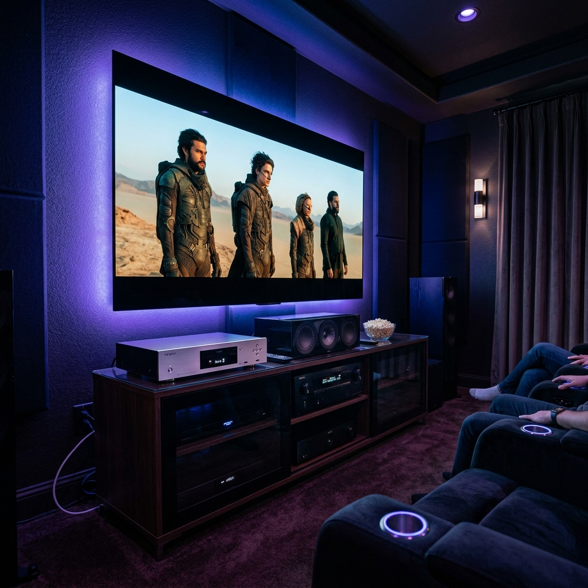
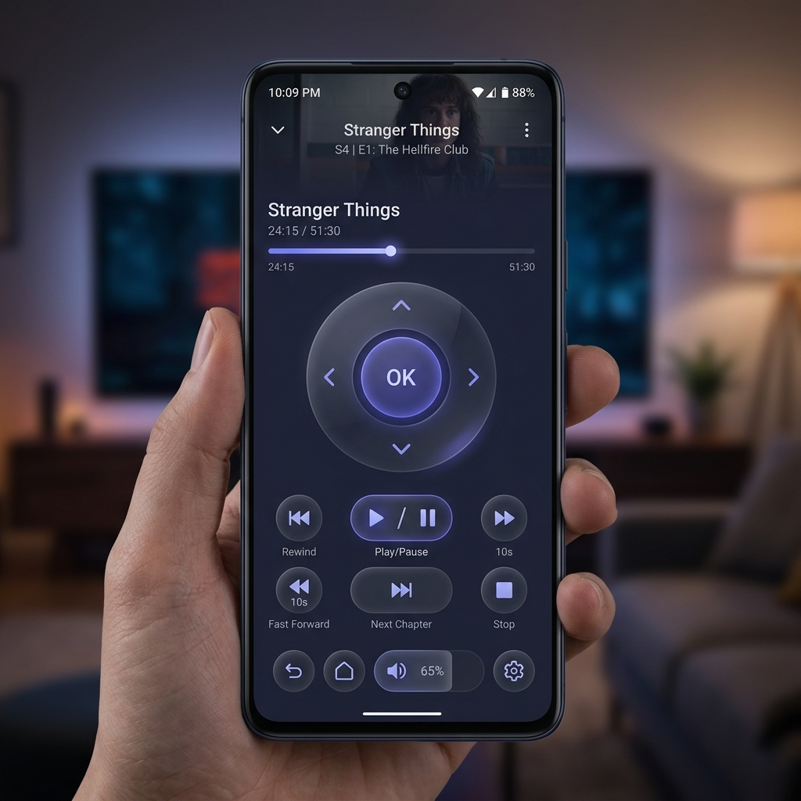

# 📽️ Xnoppo Elite V3 (Versión Docker)
[English Version](./README_EN.md)



**Xnoppo Elite V3** es una evolución mayor del proyecto original [Xnoppo v2](https://github.com/Srebollo/xnoppo). Se ha rediseñado desde cero para ofrecer una experiencia visual de lujo y una robustez técnica superior.

---

## 🆚 Comparativa: Xnoppo v2 vs Xnoppo V3 Elite

| Característica | Xnoppo v2 | Xnoppo V3 Elite |
| :--- | :--- | :--- |
| **Interfaz de Usuario** | Básica / Funcional | **Cinematográfica (Elite)** |
| **Temas** | Único (Oscuro) | **Dual (Oscuro / Emby Light Style)** |
| **Control de Logs** | Fijo en consola | **Dinámico / Scroll Asistido / Niveles** |
| **Reproducción ISO** | Manual / A veces falla | **Auto-Healing (Reintento automático)** |
| **Navegación Móvil** | Limitada | **Full Responsive (Sliding Drawer)** |
| **Configuración** | Archivo manual | **Dashboard Web Completo** |

---

## 🐳 ¿Por qué Docker? (La gran diferencia con la v2)

A diferencia de la versión original (que era un script de Python manual), Xnoppo Elite V3 ha sido reconstruido como un servicio nativo de Docker. Esto resuelve los tres grandes problemas de la v2:

1.  **🚀 Instalación en Segundos**: No necesitas instalar Python ni librerías manualmente. Todo lo necesario viene empaquetado en el contenedor.
2.  **🛡️ Sistema Inmortal**: Gracias a las políticas de Docker, si el sistema detecta un error o el servidor se reinicia, Xnoppo vuelve a levantarse automáticamente en milisegundos.
3.  **🎨 Gestión Web**: Olvídate de editar archivos de texto con el bloc de notas. Todo se controla desde el nuevo panel visual "Elite Dashboard".

---

### 🚀 ¿Qué se ha mejorado en la V3?
*   **💎 Estética Denon/Emby**: Un diseño de interfaz inspirado en los equipos de gama alta, con fondos dinámicos y micro-animaciones.
*   **🛠️ Motor de Auto-Curación**: Lógica inteligente que detecta fallos en el arranque de archivos pesados y los soluciona sin intervención del usuario.
*   **📊 Consola Pro**: Un visualizador de registros profesional que permite pausar, filtrar y ajustar la verbosidad en tiempo real.
*   **🌍 Multi-Idioma Nativo**: Selector dinámico de idioma (ES/EN) integrado en la cabecera.
*   **🐳 Migración a Docker**: Arquitectura basada en contenedores para máxima estabilidad, eliminando la necesidad de reinicios manuales constantes.

---

## 🚀 Entorno de Pruebas Certificado
Esta versión ha sido testeada exhaustivamente en la siguiente configuración, garantizando estabilidad total:
*   **Servidor**: Synology DS423+ (Docker).
*   **Reproductores Origen**: Nvidia Shield TV Pro y **Chinoppo M901**.
*   **Receptor AV**: Denon AVC-X3800H.
*   **Control de Acceso**: Probado con éxito desde navegadores **Chrome** y dispositivos **móviles** (iOS/Android).

> [!CAUTION]
> **Nota sobre Compatibilidad de TV**: El sistema incluye opciones para controlar televisores (RS232/IP), pero estas funciones **no han sido testeadas** en televisores LG u otras marcas, ya que el entorno de pruebas utiliza un **Proyector**. Aunque la lógica está implementada, esta sección se considera "experimental" hasta que sea validada en un entorno con TV física.

---

## 📋 Requisitos del Sistema

### Software y Versiones
*   **Python**: v3.9 o superior.
*   **Docker**: v20.10+ con **Docker Compose**.
*   **Emby Server**: v4.7+ (se recomienda tener habilitado el acceso remoto/API).
*   **Protocolos de Red**: NFS (v3/v4) o SMB (v2/v3).

---

## 🐋 Guía de Instalación Paso a Paso

> [!IMPORTANT]
> Debes tener **Docker** y **Docker Compose** instalados en tu servidor (Synology, Unraid, Linux, etc.) antes de comenzar.

1.  **Preparar la Carpeta**:
    Crea una carpeta en tu servidor (ej: `/docker/xnoppo`) y sube todos los archivos de este repositorio dentro de ella.
2.  **Preparar la Configuración**:
    El sistema generará un `config.json` automático, pero asegúrate de que el archivo `docker-compose.yml` esté presente en la raíz.
3.  **Desplegar el Contenedor**:
    Abre una terminal en esa carpeta y ejecuta:
    ```bash
    sudo docker-compose up -d --build
    ```
    *(Se te pedirá la **contraseña de administrador** para autorizar la instalación).*
    
    *Este comando creará un entorno virtual aislado (contenedor) donde correrá Xnoppo sin ensuciar tu sistema operativo.*
4.  **Acceso Inicial**: Entra en `http://TU_IP:8090`. Se abrirá el asistente de bienvenida "Elite" para seleccionar idioma y tema.

---

## ⚙️ Guía de Configuración y Ajustes Recomendados

Para un funcionamiento "Elite", utiliza estas configuraciones probadas:

### 📡 Servidor y Reproductor
| Opción | Recomendación | ¿Por qué? |
| :--- | :--- | :--- |
| **Protocolo de Red** | **NFS** | Es significativamente más rápido en el arranque de archivos ISO y carpetas BDMV que SMB. |
| **Oppo IP** | **Estática** | Evita que el dashboard pierda la conexión si el router cambia la IP del reproductor. |
| **Refresh Rate** | **5 Segundos** | El equilibrio perfecto entre fluidez de la interfaz y carga de red baja. |
| **Auto-Healing** | **Activado** | (Interno) Re-intenta automáticamente la carga de ISOs si fallan al primer intento. |

### 🔊 Receptor AV y Otros
*   **Gestión de Energía (AVR Always ON)**: Se recomienda activar si quieres que el receptor AV se encienda/apague sincronizado con el Oppo. Desactívalo si prefieres controlar el encendido manualmente para otros usos (como escuchar música).
*   **Esperar Montaje NFS**: Esta opción añade un pequeño retraso controlado para asegurar que el Oppo ha montado la carpeta antes de enviar la orden de Play, evitando pantallas negras.
*   **Auto-Refresh Log**: Mantener activado en la sección de **Estado**. Te permite ver qué está pasando "bajo el capó" en tiempo real sin tener que refrescar la página manualmente.

---

## 📱 Control Remoto Virtual: Tu Plan B
¿Se te han acabado las pilas del mando original? ¿No encuentras el mando del Chinoppo? No hay problema. 

Xnoppo Elite V3 incluye un **Control Remoto Virtual** totalmente funcional y optimizado para mobiles. 

 *(Placeholder: Añade aquí tu captura)*

*   **D-Pad Táctil**: Navegación precisa por los menús del Oppo.
*   **Controles de Transporte**: Play, Pause, Stop y saltos de capítulo con un toque.
*   **Botones Directos**: Acceso rápido a Home, Back, Info y Settings.

---

## ⏳ Nota Técnica: El "Delay" de 10 Segundos
Es normal experimentar una espera de unos **10 segundos** desde que pulsas "Reproducir" en Emby hasta que el Oppo/Chinoppo arranca. Esto se debe a:
1.  **Handshake de Red**: La señal viaja desde el cliente Emby al Servidor, luego el Servidor emite un evento vía WebSocket que Xnoppo (en Docker) debe capturar y procesar.
2.  **Montaje de Archivo**: El Oppo debe recibir la orden, solicitar acceso a la carpeta SMB/NFS del servidor y cargar el índice del archivo (especialmente lento en ISOs de 80GB+).
3.  **Docker Overhead**: El aislamiento de red de Docker añade una latencia mínima de milisegundos que, sumada al tiempo de respuesta de la API del Oppo, genera este intervalo de preparación.

---

## ❓ Preguntas Frecuentes (FAQ)

**P: ¿Por qué no arranca la película si uso un servidor que no es Synology?**
*   **R:** Si usas servidores como Unraid o TrueNAS, verifica que el puerto 8090 esté libre y que las rutas de red (Paths) coincidan exactamente con lo que el Oppo ve. Synology usa `/volume1/`, mientras que otros sistemas usan rutas distintas.

**P: El log dice "Connection Refused" al intentar hablar con el Oppo.**
*   **R:** Asegúrate de que el Oppo tenga activada la opción de "Network Control" en sus ajustes de red.

**P: Los archivos ISO se quedan en pantalla negra al inicio.**
*   **R:** Esto suele ser un problema de permisos NFS. Asegúrate de que el NAS permita el acceso a la IP del Oppo con privilegios de lectura y "Map root to admin".

---

## ⚠️ Nota para otros Servidores
Aunque este software ha sido perfeccionado para Synology, puede correr en cualquier entorno Docker. Si encuentras errores de montaje o permisos, revisa la sección de **Rutas de Red** en el dashboard para ajustar los reemplazos de texto (ej: cambiar `/volume1/` por tu ruta real).

---
*Desarrollado con ❤️ para la comunidad de entusiastas de Chinoppo.*
